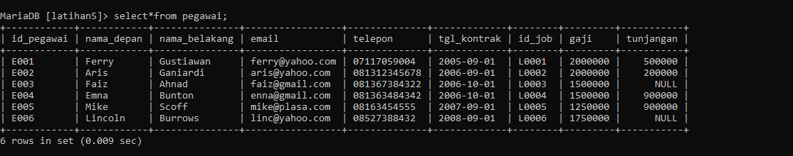

Nama|NIM|Kelas|Mata Kuliah|
|----|---|-----|------|
|**fajar julianwar muslimin**|**312310672**|**TI.23.A6**|**Basis Data**|

# SQL Query Filtering

## Membuat Table Pegawai
```sql
CREATE TABLE pegawai (
    id_pegawai VARCHAR(10) PRIMARY KEY,
    nama_depan VARCHAR(50),
    nama_belakang VARCHAR(50),
    email VARCHAR(100),
    telepon VARCHAR(15),
    tgl_kontrak DATE,
    id_job VARCHAR(10),
    gaji INT,
    tunjangan INT
);
```

## Memasukan Data ke Dalam Table
```SQL
INSERT INTO pegawai (id_pegawai, nama_depan, nama_belakang, email, telepon, tgl_kontrak, id_job, gaji, tunjangan) VALUES
('E001', 'Ferry', 'Gustiawan', 'ferry@yahoo.com', '07117059004', '2005-09-01', 'L0001', 2000000, 500000),
('E002', 'Aris', 'Ganiardi', 'aris@yahoo.com', '081312345678', '2006-09-01', 'L0002', 2000000, 200000),
('E003', 'Faiz', 'Ahnad', 'faiz@gmail.com', '081367384322', '2006-10-01', 'L0003', 1500000, NULL),
('E004', 'Emna', 'Bunton', 'enna@gmail.com', '081363484342', '2006-10-01', 'L0004', 1500000, 900000),
('E005', 'Mike', 'Scoff', 'mike@plasa.com', '08163454555', '2007-09-01', 'L0005', 1250000, 900000),
('E006', 'Lincoln', 'Burrows', 'linc@yahoo.com', '08527388432', '2008-09-01', 'L0006', 1750000, NULL);
```

# Tugas Praktikum

## Buat Table Pegawai dan Isi Data nya Seperti Berikut :



# Tugas Praktikum

### 1. Tampilkan pegawai yang gajinya bukan 2.000.000 dan 1.250.000 !
### 2. Tampilkan pegawai yang tunjangannya NULL!
### 3. Tampilkan pegawai yang tunjangannya tidak NULL!
### 4. Tampilkan/hitung jumlah baris/record tabel pegawai!
### 5. Tampilkan/hitung jumlah total gaji di tabel pegawai!
### 6. Tampilkan/hitung rata-rata gaji pegawai!
### 7. Tampilkan gaji terkecil!
### 8. Tampilkan gaji terbesar!
